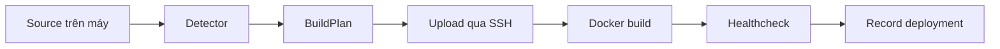
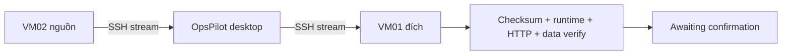

# PR title

feat: hoàn thiện deploy đa framework, migrate hai VPS và giao diện desktop

# PR description

## Bài toán

OpsPilot cần một luồng demo hoàn chỉnh cho ngày 14/09: nhận source từ máy phát triển, tự nhận diện framework, deploy thật lên VPS, sau đó migrate ứng dụng giữa hai VPS. Phiên bản trước chưa hỗ trợ đủ Next.js/Vite, chưa có migration end-to-end, collector chưa xử lý chắc chắn các ranh giới deployment/restart và giao diện còn giống dashboard web hơn ứng dụng Windows.

PR này đưa toàn bộ luồng demo về một nhánh có thể review và merge: deploy Express/Next.js/Vite, migrate app stateless và PostgreSQL, thu thập metric bền vững, cùng giao diện desktop dark gọn hơn.

## Thay đổi chính

### 1. Deploy source lên VPS

- Thêm detector có thứ tự ưu tiên rõ ràng cho Express, Next.js và Vite SPA.
- Sinh `BuildPlan` gồm Dockerfile template, build/start command, container port, healthcheck, biến môi trường và nhu cầu database.
- Truyền biến public như `NEXT_PUBLIC_*` và `VITE_*` thành Docker build arguments để giá trị được đóng vào frontend bundle đúng thời điểm build.
- Tự tạo PostgreSQL và mật khẩu khi source cần database nhưng người dùng để trống `DATABASE_URL`.
- Pipeline thống nhất gồm `PRECHECK → UPLOAD → RENDER → BUILD → DEPLOY → HEALTHCHECK → RECORD`.
- Chỉ ghi nhận deployment sau khi container và HTTP healthcheck đạt yêu cầu.
- Cho phép Vite demo gọi Express API khác public port qua CORS và đọc header `X-Total-Count`.
- Bảo toàn phiên bản trước và dọn đúng tài nguyên thuộc attempt thất bại.

### 2. Migrate giữa hai VPS

- Thêm migration job được lưu trong SQLite và phục hồi được sau khi mở lại ứng dụng.
- Pipeline gồm `PREPARE → FREEZE → BACKUP → TRANSFER → RESTORE → VERIFY → AWAITING_CONFIRM`.
- Artifact được relay qua OpsPilot desktop bằng hai SSH session; hai VPS không cần kết nối trực tiếp.
- Có backpressure, exact-byte accounting, abort và SHA-256 verification.
- Hỗ trợ app stateless và app stateful dùng PostgreSQL.
- PostgreSQL được backup bằng `pg_dump -Fc`, khôi phục bằng `pg_restore` sau khi database đích healthy.
- Chỉ cho xác nhận khi toàn bộ verify PASS; người dùng có thể giữ source làm fallback hoặc dọn source.
- Source recovery và rollback được kiểm thử cho các cửa sổ lỗi quan trọng.

### 3. Collector và metric ingestion

- Bổ sung persistent activation boundary để metric thuộc đúng deployment kể cả khi restart hoặc rollback nhiều tầng.
- Reconciliation fail-closed khi runtime lineage thiếu hoặc có cycle.
- Shared lock và transaction giữ trạng thái activation/current deployment nhất quán.
- Xử lý log rotation theo byte range, giữ episode cũ tới committed EOF và ghi riêng vùng byte không hợp lệ.
- Dedupe, scheduler single-concurrency và clean shutdown có regression.

### 4. Giao diện desktop

- Dark theme mặc định, lưu lựa chọn theme và dùng token màu/spacing/typography thống nhất.
- Titlebar native Windows, safe area cho window controls và hỗ trợ maximize/restore.
- Bố cục sidebar/pane/table gọn theo phong cách ứng dụng desktop.
- Dashboard, VPS và Settings được làm lại để giảm khoảng trống và bỏ cảm giác dashboard template.
- Bổ sung hover, selected, pressed, focus và table interaction states.
- Dropdown VPS của Deploy và hai dropdown Migrate dùng control native, tránh lỗi popup Ant Design bị đặt ngoài viewport trong Electron.
- Chuẩn hóa phần lớn nội dung hiển thị sang tiếng Việt.

## Luồng kỹ thuật

## Cách review

1. Xem detector và BuildPlan trong `app/src/main/detectors/`.
2. Xem deploy orchestration trong `app/src/main/deploy/pipeline.ts`.
3. Xem migrate state machine trong `app/src/main/migrate/service.ts` và repository tương ứng.
4. Xem activation/reconciliation trong `app/src/main/monitor/`.
5. Xem renderer trong `app/src/renderer/src/`, đặc biệt `DeployPage.tsx`, `MigratePage.tsx`, `AppTitleBar.tsx` và các design token.
6. Đọc kịch bản chi tiết và bảng giá trị môi trường trong `docs/26-kich-ban-demo-deploy-migrate-14-09.md`.
7. Đối chiếu rehearsal/evidence trong `docs/evidence/tk-a17/` và ảnh UI trong `docs/evidence/tk-a18/`.

## Kiểm thử

- Full app Vitest mới nhất: 52/53 test files và 292/293 tests PASS trong một lượt; test History duy nhất timeout ở ngưỡng 5 giây khi chạy toàn suite. Chạy lại riêng HistoryPage: 3/3 PASS, test chính hoàn tất trong 1,7 giây; đây là timeout do tải song song, không phải assertion sai.
- Deploy và migrate focused regressions: PASS.
- Collector pytest: 26/26 PASS ở rehearsal.
- ML service pytest: 19/19 PASS ở rehearsal; PR này không mở rộng tính năng ML.
- TypeScript node/web/scripts, ESLint, Prettier và production build: PASS.
- Hai rehearsal liên tiếp đã deploy Express/Next/Vite và migrate Vite + Express/PostgreSQL thành công trên cùng code SHA.
- Live verification có checksum, HTTP health, PostgreSQL row/marker và `source_kept=true`.

## Phạm vi demo

Demo ngày 14/09 chỉ trình bày deploy đa framework và migrate hai VPS. ML train/score, fault injection và auto rollback được giữ ngoài demo vì cần thêm dữ liệu vận hành để huấn luyện và kiểm chứng; dự kiến đánh giá lại sau ít nhất hai tuần.

## An toàn dữ liệu

- Không reset VPS, không chạy `docker system prune` và không sửa SQLite bằng tay.
- Migration mặc định trong demo giữ source làm fallback.
- App B và dữ liệu lịch sử không thuộc phạm vi mutation.
- Credential được lưu bằng safe storage; evidence đã scrub host/IP nhạy cảm theo phạm vi tài liệu UI.