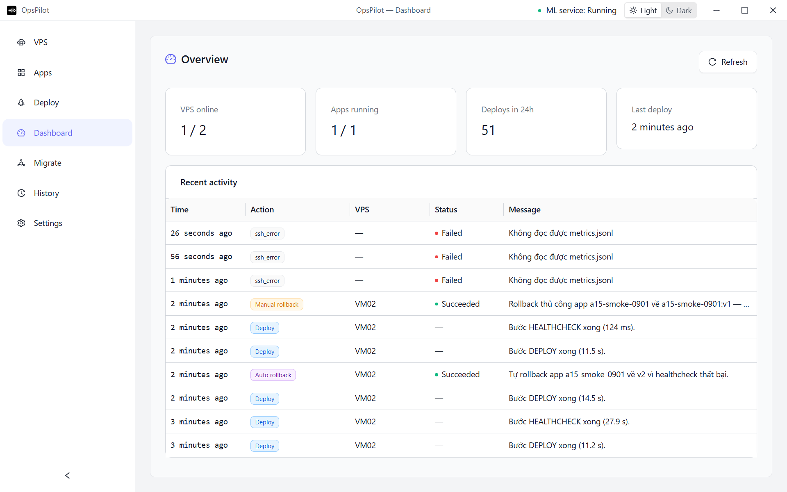
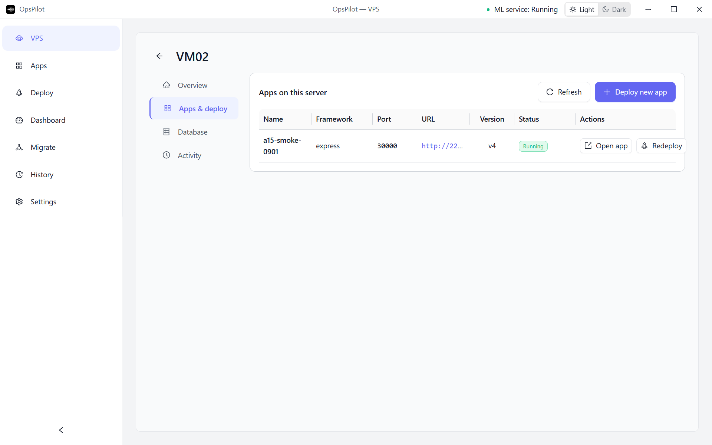

# TK-A15 — bằng chứng smoke rollback thật ngày 01/09/2026

## Kết luận

Smoke pipeline M4 trên VPS thật **PASS** đối với deploy/redeploy, auto rollback, manual rollback,
giữ dữ liệu PostgreSQL và retention ba image. VM01 không nhận TCP/22 trong phiên; VM02 được dùng
làm fallback minh bạch vì vẫn SSH được bằng key riêng của dự án.

## Môi trường

| Thành phần     | Giá trị                                       |
| -------------- | --------------------------------------------- |
| VPS chạy smoke | `VM02` — `221.121.1.80`                       |
| SSH/Docker     | user `deploy`, Docker `29.7.2`                |
| App cô lập     | `a15-smoke-0901`                              |
| Workspace      | `/opt/opspilot/a15-smoke-0901`                |
| Host port      | `30000`                                       |
| Source khỏe    | `demo-apps/express-api`                       |
| Source lỗi     | bản sao tạm, chỉ đổi `/health` thành HTTP 503 |

VM01 (`221.121.1.79`) timeout TCP/22 cả khi WARP bật và tắt. VM02 mở TCP/22, nhưng provider chưa
mở port `30000` từ Internet; vì vậy bằng chứng `/health` và `/meta` của phiên fallback được kiểm tra
qua SSH từ chính VM, đúng cơ chế healthcheck của pipeline. Public URL VM02 được ghi là giới hạn,
không khai man PASS.

## Chuỗi kiểm chứng

| Attempt | Hành động                      | Kết quả                                                                    |
| ------- | ------------------------------ | -------------------------------------------------------------------------- |
| v1      | Deploy source khỏe             | `running`; `/health` 200; PostgreSQL 1.000 dòng                            |
| —       | Thêm marker dữ liệu            | HTTP 201; tổng 1.001 dòng                                                  |
| v2      | Redeploy source khỏe           | `running`; port giữ nguyên; vẫn 1.001 dòng                                 |
| v3      | Deploy source có `/health` 503 | 10 probe fail; auto rollback về image runtime v2; trạng thái `rolled_back` |
| v4      | Manual rollback về v1          | `running`; `is_rollback_of=1`; vẫn 1.001 dòng                              |

Kết thúc có đúng ba tag `v1`, `v2`, `v3`; container app chạy image runtime `v1`. Không đụng app
khác trên VM02.

## Lỗi thật tìm thấy và sửa

Lần smoke đầu phát hiện compose báo container `running` trước khi Express/PostgreSQL sẵn sàng.
Nhánh auto/manual rollback chỉ probe HTTP một lần nên có thể kết luận fail giả. Pipeline được sửa
để rollback dùng cửa sổ readiness hữu hạn `10 lần × 3 giây`, cùng nguyên tắc với deploy thường.
Regression khóa trường hợp probe rollback đầu fail và probe sau thành công.

## Ảnh

### Dashboard — auto/manual rollback đều thành công

### VPS Control — app v4 đang Running trên VM02

## Gate local sau sửa

- Deploy pipeline: `22/22 PASS`.
- Sáu file renderer từng timeout khi chạy song song: `35/35 PASS` với `--maxWorkers=1`.
- Lint: 0 error, 16 warning renderer baseline.
- Typecheck: PASS.
- Build: PASS, 3.045 modules.
- Full suite ổn định với một worker: `45 files · 220/220 PASS`.

Code sửa readiness: commit local `6fd3efd` trên `feat/m04-deploy-hardening`.
